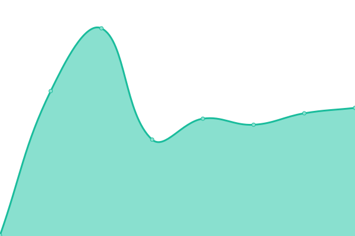

# [📈 Live Status](https://status.dimescheduler.com): <!--live status--> **🟩 All systems operational**

This repository contains the open-source uptime monitor and status page for [Dime.Scheduler](www.dimescheduler.com).

<!--start: status pages-->
<!-- This summary is generated by Upptime (https://github.com/upptime/upptime) -->
<!-- Do not edit this manually, your changes will be overwritten -->
<!-- prettier-ignore -->
| URL | Status | History | Response Time | Uptime |
| --- | ------ | ------- | ------------- | ------ |
|  App | 🟩 Up | [app.yml](https://github.com/dime-scheduler/status/commits/HEAD/history/app.yml) | 

 577ms
     
 | 

<a href="https://status.dimescheduler.com/history/app">99.72%</a>
    

|  API | 🟩 Up | [api.yml](https://github.com/dime-scheduler/status/commits/HEAD/history/api.yml) | 

 561ms
     
 | 

<a href="https://status.dimescheduler.com/history/api">99.73%</a>
    

|  Database | 🟩 Up | [database.yml](https://github.com/dime-scheduler/status/commits/HEAD/history/database.yml) | 

 793ms
     
 | 

<a href="https://status.dimescheduler.com/history/database">3.29%</a>
    

|  Services | 🟩 Up | [services.yml](https://github.com/dime-scheduler/status/commits/HEAD/history/services.yml) | 

 234ms
     
 | 

<a href="https://status.dimescheduler.com/history/services">99.73%</a>
    

|  [Docs](https://docs.dimescheduler.com) | 🟩 Up | [docs.yml](https://github.com/dime-scheduler/status/commits/HEAD/history/docs.yml) | 

 196ms
     
 | 

<a href="https://status.dimescheduler.com/history/docs">100.00%</a>
    

|  [Website](https://www.dimescheduler.com) | 🟩 Up | [website.yml](https://github.com/dime-scheduler/status/commits/HEAD/history/website.yml) | 

 1197ms
     
 | 

<a href="https://status.dimescheduler.com/history/website">99.76%</a>
    

<!--end: status pages-->

[**Visit our status website →**](https://status.dimescheduler.com)

## 📄 License

- Powered by: [Upptime](https://github.com/upptime/upptime)
- Code: [MIT](./LICENSE) © [Anand Chowdhary](https://anandchowdhary.com), supported by [Pabio](https://pabio.com)
- Data in the `./history` directory: [Open Database License](https://opendatacommons.org/licenses/odbl/1-0/)
